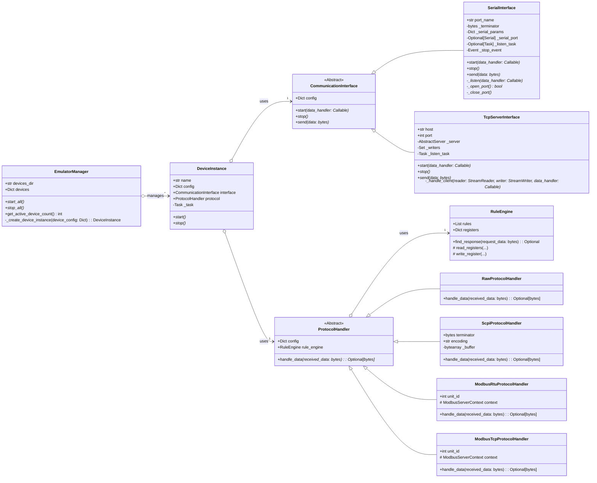

# EmuNinja Class Diagram

**Notes:**

- `*` denotes an `async` method.
- `Optional~T~` indicates the method might return `T` or `None`.
- `Dict~K,V~` or `List~T~` show generic types.
- Relationships show composition (`o-->`) and inheritance (`<|--`).
- Internal implementation details are simplified for clarity.
