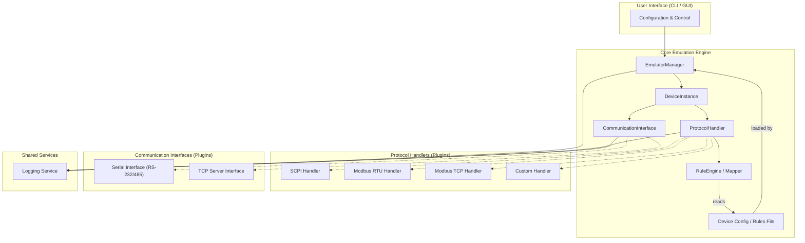

# System Patterns: EmuNinja

## 1. Core Architecture (Proposed)

A modular, layered architecture is proposed:

- **User Interface (UI):** Handles user interaction for configuration loading, starting/stopping emulators, and viewing status/logs. Could be a CLI initially, potentially a GUI later.
- **Emulator Manager:** Orchestrates the creation and lifecycle of `DeviceInstance`s based on user configuration.
- **Device Instance:** Represents a single emulated device, holding references to its specific `CommunicationInterface` and `ProtocolHandler`.
- **Communication Interface:** Abstract base class/interface for handling the low-level transport (Serial, TCP). Concrete implementations manage the specifics of opening ports/sockets, reading data, and writing data. (Strategy Pattern)
- **Protocol Handler:** Abstract base class/interface for parsing incoming data according to a specific protocol (SCPI, Modbus RTU, etc.) and formatting outgoing responses. It uses the `RuleEngine/Mapper` to determine the correct response for a given command. (Strategy Pattern)
- **Rule Engine/Mapper:** Reads the device configuration file (e.g., YAML) and provides a mechanism for the `ProtocolHandler` to look up the appropriate response based on the received command/request data.
- **Configuration:** Files (e.g., YAML) defining device profiles, including communication parameters, protocol type, and command-response rules.
- **Logging Service:** Centralized service for logging events from all components.

## 2. Key Design Patterns

- **Strategy Pattern:** Used for both `CommunicationInterface` and `ProtocolHandler`. Allows swapping different communication methods and protocol implementations easily without changing the core `DeviceInstance` or `EmulatorManager`. The specific strategy (e.g., `SerialInterface`, `ModbusRTUHandler`) is chosen at runtime based on configuration.
- **Factory Pattern (or Abstract Factory):** The `EmulatorManager` could use a factory to create the appropriate `CommunicationInterface` and `ProtocolHandler` objects based on the configuration file. This decouples the manager from the concrete implementation details.
- **Plugin Architecture:** The design inherently supports a plugin model. New communication interfaces and protocol handlers can be developed as separate modules/classes implementing the required interfaces and registered with the core engine, potentially dynamically.
- **Observer Pattern (Optional):** Could be used for notifying the UI or other components about events like received messages, sent responses, or errors.

## 3. Component Relationships

- The `EmulatorManager` creates and manages `DeviceInstance`s.
- Each `DeviceInstance` combines one `CommunicationInterface` with one `ProtocolHandler`.
- The `CommunicationInterface` listens for incoming connections/data.
- Received data is passed to the `ProtocolHandler`.
- The `ProtocolHandler` parses the data, uses the `RuleEngine` to find a matching rule/command, generates a response, and passes it back to the `CommunicationInterface` to be sent.
- All major components utilize the `Logging Service`.

## 4. Extensibility Points

- Adding new `CommunicationInterface` implementations (e.g., UDP, WebSocket).
- Adding new `ProtocolHandler` implementations (e.g., specific vendor protocols).
- Enhancing the `RuleEngine` (e.g., support for more complex matching logic, stateful responses).
